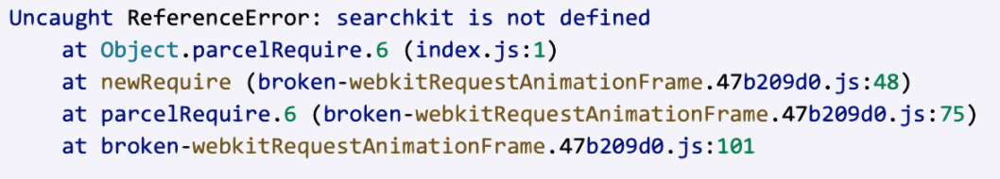

*Question 1*  

 
From: marissa@startup.com  
Subject:  Bad design  

Hello,  
  
Sorry to give you the kind of feedback that I know you do not want to hear, but I really hate the new dashboard design. Clearing and deleting indexes are now several clicks away. I am needing to use these features while iterating, so this is inconvenient.  
   
Thanks,  
Marissa  

*Answer 1* 

Hi Marissa,

Thanks for reaching out and sharing your honest feedback with us. I completely understand how frustrating it is when a UI update slows down your momentum, especially when you're actively iterating and need to clear or delete indexes frequently.

I’m passing your feedback directly over to our Product and Design teams so they can see exactly how this extra friction impacts power users during development.

In the meantime, the absolute fastest way to bypass those dashboard clicks entirely while you're building is to take a programmatic approach. You can clear or delete an index in a single shot using the Algolia CLI:

To clear all records from an index instantly:
"algolia index clear your_index_name"

To delete an index entirely:
"algolia index delete your_index_name"

If you prefer, you can also script this directly into your existing development workflows using our API clients (via the clearObjects() or delete() methods). You can check out the full syntax and parameters for those methods here:
https://www.algolia.com/doc/libraries/sdk/methods/search/clear-objects
https://www.algolia.com/doc/libraries/sdk/methods/search/delete-index
https://www.algolia.com/doc/libraries/sdk/v1/methods/delete-objects

Let me know if you want to get on call so we can set up a quick automation snippet for this together. I’d be happy to walk you through it!

Best,

Nickolas Stricker
Customer Success Engineer @ Algolia
nickolas.stricker@algolia.com
  
--

*Question 2*:   
  
From: carrie@coffee.com  
Subject: URGENT ISSUE WITH PRODUCTION!!!!  
  
Since today 9:15am we have been seeing a lot of errors on our website. Multiple users have reported that they were unable to publish their feedbacks and that an alert box with "Record is too big, please contact enterprise@algolia.com".  
  
Our website is an imdb like website where users can post reviews of coffee shops online. Along with that we enrich every record with a lot of metadata that is not for search. I am already a paying customer of your service, what else do you need to make your search work?  
  
Please advise on how to fix this. Thanks.   

*Answer 2*:   

Hi Carrie,

I completely get the urgency here, having production throw errors for your users is incredibly stressful, so let’s get this sorted out right away.

The "Record is too big" error pops up because Algolia has strict record size limits (typically between 10KB and 100KB per object, depending on your plan tier) to keep search speeds lightning-fast. When your users started posting longer reviews or the non-search metadata expanded this morning, those specific records pushed past the maximum payload limit, causing our API to reject them.

Since a large chunk of the metadata you're tracking isn’t actually meant for search, the standard best practice here is to decouple your heavy metadata from your search index.

Here is how we can fix this permanently:

1. Source of Truth: Keep your primary database as the source of truth for the heavy, non-searchable metadata fields and long text reviews.

2. Streamline Algolia: Only sync search-critical fields to Algolia—like the coffee shop name, general location tags, and a short review snippet.

3. Reference via ID: Keep a unique identifier (like a shop_id or review_id) on your Algolia records. When a user searches and selects a result, use that ID to instantly fetch the heavy metadata blocks from your database on the frontend.

This keeps your index lightweight, kills the size errors completely, and keeps your search performance running smoothly. For some deeper context on how to structure this, take a look at our support breakdown here: https://support.algolia.com/hc/en-us/articles/4406981897617-Is-there-a-size-limit-for-my-index-records

Let me know if you have a few minutes to jump on a quick call today, we can review your payload structure together and strip out those non-search attributes right away!

Best,

Nickolas Stricker
Customer Success Engineer @ Algolia
nickolas.stricker@algolia.com
--

*Question 3*:   

From: marc@hotmail.com  
Subject: Error on website  
  
Hi, my website is not working and here's the error:  
  
  
  
Can you fix it please?  

*Answer 3*:  

Hi Marc,

Thanks for reaching out and sending over that screenshot. I took a look at the error, and I can definitely help you figure out what’s going on here.

The error Uncaught ReferenceError: searchkit is not defined means your site is trying to use a library called "Searchkit," but it isn't loading correctly. The big thing to know here is that Searchkit is actually a 3rd party tool built for Elasticsearch, so it isn't natively compatible with Algolia's backend.

Since it’s an external library, I can’t debug that specific code for you, but I am 100% here to help you move over to a solution that actually works with our system. I’d strongly suggest moving to InstantSearch.js. It’s our official library, it’s super fast, and it’s built to handle everything you’re trying to do. You can see how to get started with it in our InstantSearch UI documentation.

To get the official packages, you just need to run:

"npm install algoliasearch instantsearch.js"

I’ve got a step-by-step guide I can send you that makes switching over pretty easy. Check out the Hits Widget API to see how it renders:
https://www.algolia.com/doc/api-reference/widgets/hits/js

If you need any help with the implementation as you make the move, just let me know. I'm happy to support you through the transition!

Best,

Nickolas Stricker
Customer Success Engineer @ Algolia
nickolas.stricker@algolia.com